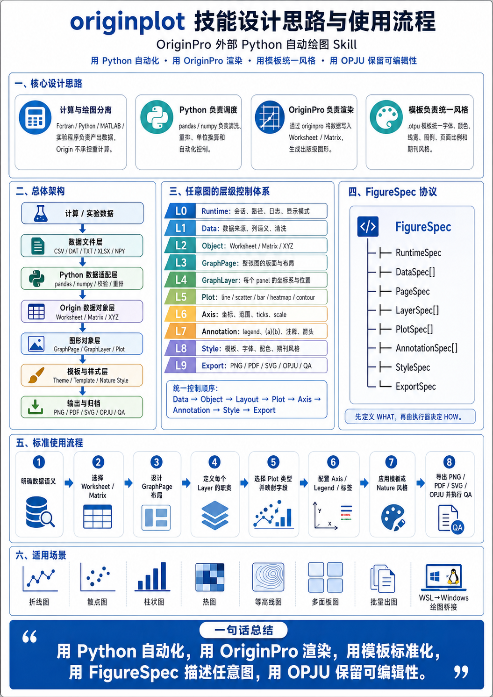
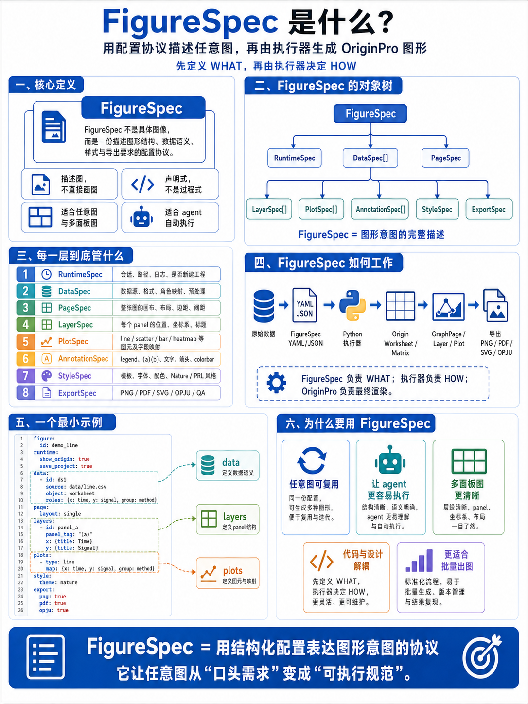

# originplot skill

[](LICENSE)
[](https://github.com/xiaoou/originplot-skill/stargazers)
[](https://github.com/xiaoou/originplot-skill/issues)

`originplot` is a skill for automating Origin/OriginPro figures from external Python. It treats OriginPro as a publication-quality rendering and template engine while keeping data preparation, computation, batching, and export orchestration in Python.

Designed for scientific and engineering workflows that need repeatable Origin workbooks, editable OPJU archives, and publication-ready exports.



## What It Does

- Guides external Python automation through Origin/OriginPro's `originpro` package.
- Maps raw data into Origin workbooks, worksheets, matrix sheets, graph pages, graph layers, plots, axes, legends, annotations, themes, and exports.
- Defines a reusable hierarchy-control model for arbitrary figures.
- Provides a declarative `FigureSpec` protocol for agent-friendly figure generation.
- Encourages Origin templates (`.otpu`, `.otp`) for stable visual style.
- Includes Nature-style palette and publication-figure defaults.
- Supports single figures, multi-panel figures, heatmaps, contours, grouped plots, batch exports, and OPJU archiving.

## Repository Layout

```text
.
├── README.md
├── LICENSE
├── CONTRIBUTING.md
├── pyproject.toml
├── FigureSpec.png
├── Main.png
└── originplot-skill/
    ├── SKILL.md                   # Main skill instructions
    ├── FIGURESPEC_PROTOCOL.md     # Declarative figure protocol
    └── examples/
        └── any_figure_demo.yaml   # Minimal FigureSpec example
```

## Requirements

- Windows with Origin or OriginPro installed.
- Windows Python that can import `originpro`.
- Python packages commonly used with this workflow:

```bash
pip install originpro pandas numpy pyyaml
```

External OriginPro automation depends on Origin's local automation server and COM integration. WSL/Linux should not call `originpro` directly unless your workflow explicitly bridges into Windows Python.

## Installation

Clone the repository:

```bash
git clone https://github.com/deliuou/originplot-skill.git
cd originplot-skill
```

Install the skill:

```bash
mkdir -p "$HOME/.skills/originplot"
cp -R originplot-skill/. "$HOME/.skills/originplot/"
```

Then invoke it when you need OriginPro automation help.

## Quick Start

**Workflow rule: FigureSpec first → confirm with user → then plot.**

1. Prepare clean or raw data files in CSV, DAT, TXT, or Excel format.
2. Describe the figure as a `FigureSpec` YAML file, starting from [`originplot-skill/examples/any_figure_demo.yaml`](originplot-skill/examples/any_figure_demo.yaml).
3. Present the generated FigureSpec to the user for review and confirmation.
4. Only after the user approves the FigureSpec, proceed to generate the Python script and execute the plotting.
5. Export figures and save the editable `.opju` project.

> Never start plotting without explicit user confirmation of the FigureSpec.

## FigureSpec

`FigureSpec` is the declarative protocol used by this skill to describe arbitrary figures. It separates figure intent from OriginPro implementation details:

```text
clean data -> Origin objects -> GraphPage/GraphLayer/Plot -> export -> OPJU
```



Core objects:

```text
FigureSpec
    |- RuntimeSpec
    |- DataSpec[]
    |- PageSpec
    |- LayerSpec[]
    |- PlotSpec[]
    |- AnnotationSpec[]
    |- StyleSpec
    |- ExportSpec
```

See [`FIGURESPEC_PROTOCOL.md`](originplot-skill/FIGURESPEC_PROTOCOL.md) for the full schema and examples.

## Typical Workflow

```text
simulation / experiment / analysis
    -> CSV, DAT, TXT, XLSX, NPY, or NPZ data
    -> Python data adapter
    -> Origin worksheet or matrix
    -> Origin graph page and layers
    -> Origin template and style
    -> PNG/PDF/SVG/TIFF export and OPJU archive
```

The skill's core design rule:

```text
Use Python to automate.
Use OriginPro to render.
Use templates to standardize.
Use FigureSpec to formalize arbitrary figures.
Use OPJU to preserve editability.
```

## Documentation

- [`SKILL.md`](originplot-skill/SKILL.md): main skill instructions.
- [`FIGURESPEC_PROTOCOL.md`](originplot-skill/FIGURESPEC_PROTOCOL.md): full declarative figure protocol.
- [`any_figure_demo.yaml`](originplot-skill/examples/any_figure_demo.yaml): minimal example spec.

Official Origin references:

- <https://www.originlab.com/doc/ExternalPython>
- <https://www.originlab.com/doc/ExternalPython/External-Python-Code-Samples>
- <https://www.originlab.com/doc/python>
- <https://www.originlab.com/doc/python/Examples/Graphing>
- <https://pypi.org/project/originpro/>

## Contributing

Contributions are welcome. Please keep the skill concise and agent-oriented:

- Put core operating instructions in `SKILL.md`.
- Put longer protocols and schemas in reference documents.
- Keep examples small and runnable.
- Avoid adding large generated outputs, OPJU files, or raw datasets to Git.

See [`CONTRIBUTING.md`](CONTRIBUTING.md) for contribution guidelines.

## License

This project is released under the MIT License. See [`LICENSE`](LICENSE).
